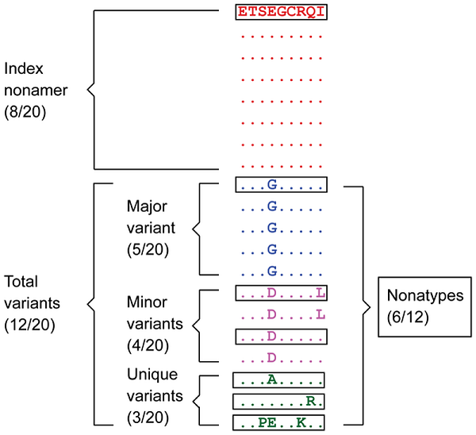
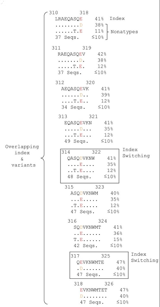
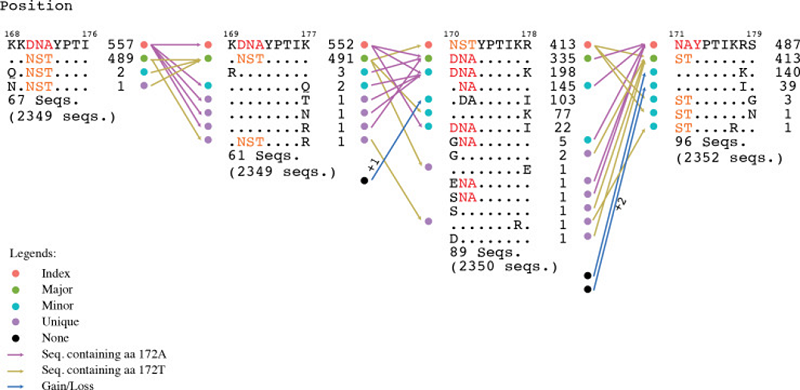

Background
==========

    .. admonition:: Motif Switch Definition
    
     Motif switching, another relevant finding, revealed that there were a significant number of nonamer positions in the proteome where fitness change of one or more amino acids, such as through mutations, changed the incidence of a given nonamer sequence across its overlapping positions, resulting in a sequence rank change, and thus, a motif change (Abd Raman, H., et al., 2020)

The rapid mutation of viruses and the limited characterization of the composition and incidence of the variant population are 
major obstacles to the development of an effective vaccines. A continuing goal towards this is a greater understanding of 
proteome sequence diversity of viruses in the context of the immune system (antigenic diversity), the dynamics of mutation, 
and effective strategies to overcome the diversity for vaccine design. 

Analysis of the aligned overlapping k-mer positions of viruses allow us to dissect the sequence diversity, each overlapping k-mer 
position is quantitatively analyzed for four patterns of sequence diversity motifs: (1) "index", the most prevalent sequence; 
(2) "major" variant, the most common variant sequence; (3) "minor" variants, multiple different sequences, each with an incidence less 
than that of the major variant; and (4) "unique" variants, each observed only once in given position.

Below is the illustration for the sequence motifs:

 
 The different sequence motifs of the aligned sequences are identified as shown with 20 sequences of a model nonamer (9-mer) position. 
 The “Index” nonamer is the most prevalent sequence, present in 8 of the 20 isolates. The “Major” variant is the most common variant of the index 
 (5/20). “Minor” variants are multiple different repeated sequences, each with incidences less than that or occasionally equal of the major variant. 
 “Unique” variants are those represented by a single aligned sequence. “Nonatypes” (boxed) are the distinct variant sequences at a given nonamer 
 position; in this example one of major, two of minor, and three of unique. From "Dissecting the Dynamics of HIV-1 Protein Sequence Diversity" by Hu Y, et al., 2013, PLoS ONE,
 8(4), Materials and Methods section, Figure 1 (https://doi.org/10.1371/journal.pone.0059994.g001). CC BY.

Index Switching
---------------

The dominance of an index is challenged by its variants, where fitness change of one or more amino acids, such as through mutations, 
changes the incidence of a given k-mer sequence across its overlapping positions, resulting in a sequence rank change, and thus, a motif change, 
such as dominance switch between the major variant and the prevailing index. The figure below illustrates this phenomenon.

 
 The aligned overlapping nonamer positions (310–318, 311–319, etc.) represent the sliding windows of the alignment region. Each nonamer position is shown with the index sequence, two of the variant nonatype sequences and the total number of remaining variant nonatypes of incidence equal or below 10%. The first nonamer position, 310 to 318, is shown with the index sequence (41%) containing aa E at the 9th position. The major variant (38%) contains the variable aa D at the corresponding position. A minor variant (11%) has a mutation at aa position 7 relative to the index. A total of 37 nonatypes had individual incidences less or equal to 10%. The dominance of aa E in the index is maintained for the next few nonamer positions. At position 314 to 322, index switching is observed, where the sequence with aa D is now the index (41%) and the one with E is the major variant (35%). This relationship continued till position 316–324, with reversal of sequence ranks to the original state at position 317–325, where the sequence with aa E is the index. At an index switching position, the index is alternative to that expected, relative to the preceding position. From "Dissecting the Dynamics of HIV-1 Protein Sequence Diversity" by Hu Y, et al., 2013, PLoS ONE, 8(4), Results section, Figure 8 (https://doi.org/10.1371/journal.pone.0059994.g008). CC BY.
  
Motif Switches
--------------

Besides index switch, we also observed switches involving the other motifs, which we demonstrated in our H5N1 paper and thus termed this broader
observation as motif switching. We also witnessed that this was more complex than we had imagined as demonstrated by the illustration below.

 An example of motif switching events observed in avian HA protein. The alignment region shown is from position 168 to 179, comprising of four 
 overlapping nonamer positions. At the nonamer position 168–176 (with 2,349 protein sequences aligned at the position), the nonatype KKDNAYPTI 
 containing the amino acid (aa) “A” at position 172 (172A) is the predominant sequence, and thus, the index, while the nonatype KKNSTYPTI 
 containing the aa “T” at the corresponding position (172T) is the second most predominant sequence, and thus, the major variant. 
 The nonamer position also included multiple nonatypes of minor and unique variants (two nonatypes shown: a minor and a unique variant; 
 the remaining 67 nonatypes not shown). In the subsequent nonamer position (169–177), the nonamer containing aa 172A remained as the index, 
 but with a reduced incidence because a small fraction (five sequences) of the index (from the preceding position 168–176) split into four 
 different nonatypes because of a variant amino acid in each, as a result of the position shift, which contributed to the occurrence of one 
 new minor and three new unique variants at the current focal nonamer position (169–177). Meanwhile, the nonamer containing aa 172T, 
 which was the major variant at the preceding position, remained as major variant at the current focal nonamer position, but with an increase 
 in its incidence because two nonatypes (a minor variant of two copies and a unique variant) from the preceding nonamer position (168–176) merged 
 with the major variant at the current focal position 169–177. Nonetheless, the major variant of the preceding position also underwent a split, 
 where one copy became a new unique variant at the current focal position. In the next nonamer position (170–178), an index switching event is 
 observed, where the nonamer containing aa 172A has significantly dropped in incidence to be downgraded from the previous index rank to now as a 
 major variant, and replaced by the nonamer containing aa 172T (previously the major variant) as the new index. 
 As many as 217 copies (552 − 335;∼39%) of the former index sequence were split into different variant motifs, thus decreasing the incidence of 
 the sequence. Although the nonamer containing aa 172T also split into other variants, the incidence drop was less (∼16%), leaving it as the 
 sequence with the highest incidence and thus the predominant index. In the subsequent nonamer position (171–179), another index switching event 
 occurred, which witnesses a reversal of the previous switch, where now the nonamer containing aa 172A is back as the index and the nonamer 
 containing aa 172T is back as the major variant. This was due to the merger of a significant copy number of different minor and unique variants 
 with the major variant (nonamer containing aa 172A), and thus, resulting in an increase in its incidence at the current focal position 171–179 
 and becoming the predominant index. At the current focal position, it was also observed that variants can be gained from a motif classified as 
 “None” (due to indel) at the preceding position. Similarly variants can become loss, classified as “None” if the position shift introduced an 
 indel. From "Dynamics of Influenza A (H5N1) virus protein sequence diversity" by Abd Raman, H. S., et al., 2020, PeerJ, 7, Results section, Figure 6, (https://doi.org/10.7717/peerj.7954/fig-6). CC BY.
