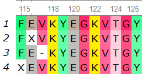

Usage
=====

.. _webservice:

Web Service
-----------

All you need to do is upload your multiple sequence alignment file in .fasta/.fa/.afa format to `MoSwA WebService <http://moswa.bioinfo.perdanauniversity.edu.my/>`_. There are three main parameters to be supplied, altough we have default values. 

   -  Motif sites: You can select any motif site(s) to be analyzed. Default is all the motifs (index,major, minor and unique) to be analyzed and reported. 
   -  k-mer size: Value to be applied for the sliding window of k. Default value is 9, because it is typically used for immunological applications, such as measure of antigenic diversity
   -  Low support: Alignment positions within the k-mer length that contain any gap, or unknown amino acid is not considered for the related position. These sequences might drop the support value and can result in artificial diversity/motif measures. Thus, MoSwA tags those low support positions that exhibit motif switches and indicate such positions in the alignment view file while discard these positions on the network and hotspot plots. Default value is 30.

In the example below, there are 4 sequences from position 115 to 126. If we are using k-mer size 9, position 115-123 will have only support of 1, because the other sequences has either a gap or an unknown amino acid within the k-mer size. However, at position 116-124, the support will increase to 2 as the last sequence in the figure will now be considered, and position 117-125 and 118-126 will have support of 3 and 4 respectively. 

.. _install:

Install Standalone
------------------
.. note::
   These instructions assume you have Python and a C/C++ Compiler on your computer.

MoSwA requires python>=3.6. To clone the repo and install the requirements of MoSwA, type the following in your terminal:

.. code-block:: bash

   git clone https://github.com/macelik/MoSwA.git
   pip install -r requirements.txt

MoSwA utilizes PyGraphviz library which is a Python interface to the Graphviz graph layout and visualization package. Thus, Graphviz needs to be installed before PyGraphviz.

* **Ubuntu/Debian:**

.. code-block:: bash

   sudo apt-get install graphviz graphviz-dev
   pip install pygraphviz
   
* **macOS:**

.. code-block:: bash

   brew install graphviz
   pip install pygraphviz
   
* **Windows:**

Download and install Graphviz:

`stable_windows_10_cmake_Release_x64_graphviz-install-2.46.0-win64.exe <https://gitlab.com/graphviz/graphviz/-/package_files/6164164/download/>`_

After that install Pygraphviz via typing the following in the PowerShell or Command Prompt

.. code-block:: bash

   python -m pip install --global-option=build_ext --global-option="-IC:\Program Files\Graphviz\include" --global-option="-LC:\Program Files\Graphviz\lib" pygraphviz

Standalone Usage
----------------

Uses the same parameters as web service, and produces the same output files in your local machine. 

.. code-block:: bash

   MoSwA.py -i AlignedFasta -m motif_sites -t int -k int -o OutFolderName
   
-i specifies input file

-t specifies the threshold for low support positions

-k specifies the k-mer length (default is 9).

-o specifies the output folder name. (All the results will be saved in here)

-m specifies the motif sites to be aligned. Single space delimited (default is all; index,major, minor and unique). 

**Specifying only index and minor sites to be analyzed with k-mer size of 15.**

.. code-block:: bash

   MoSwA.py -i sample.fasta -m index minor -t 30 -k 15 -o SampleOut
   
